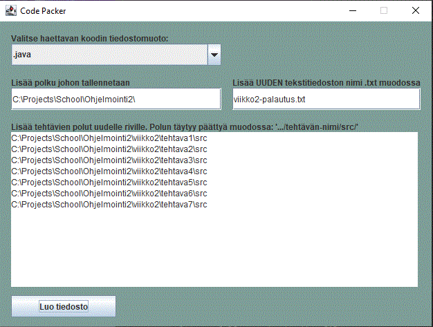
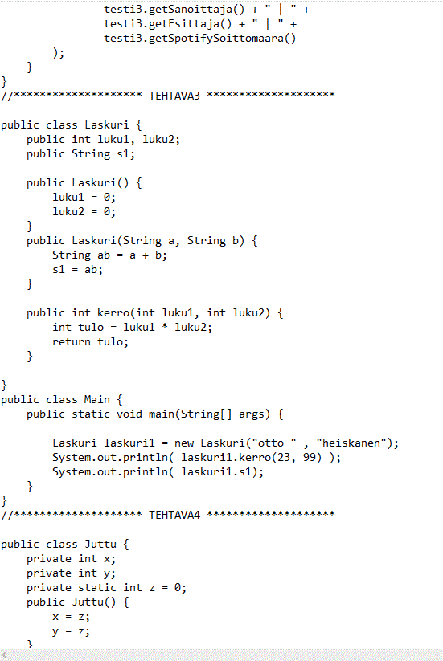

# Code Packer

* Program that helps students to pack their programming exercises into one big text file for peer reviews.
* Pathing is only tested on Windows OS
* Make sure to always check the correctness of the output file!
* Also make sure to remove all whitespaces and empty line breaks from input fields to avoid corruption!

# Example input 

# Example output
