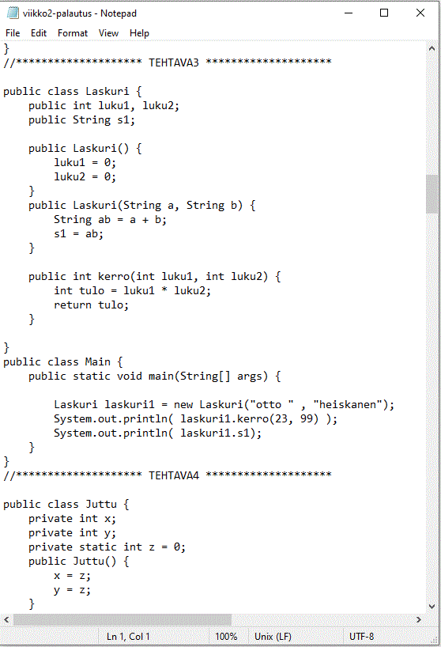

# Code Packer

* Program that helps students to pack their programming exercises into one big text file for peer reviews.
* Pathing is only tested on Windows OS
* Make sure to always check the correctness of the output file!

    Input example:

    Output example:
